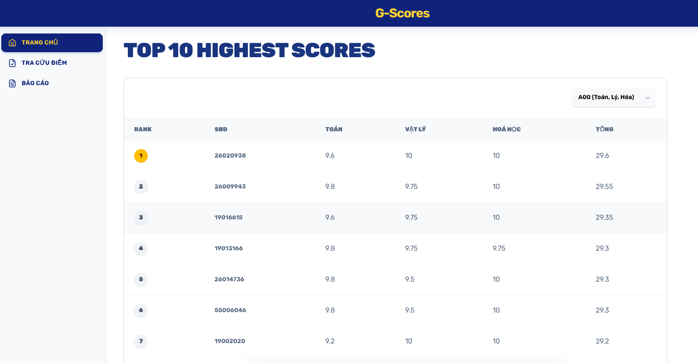
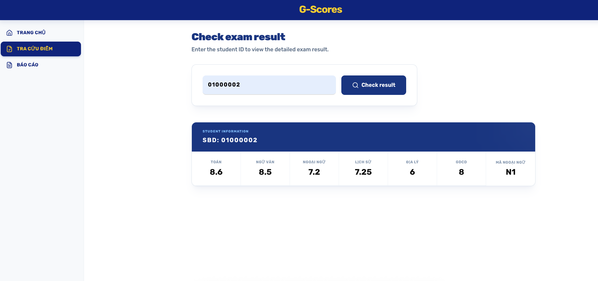
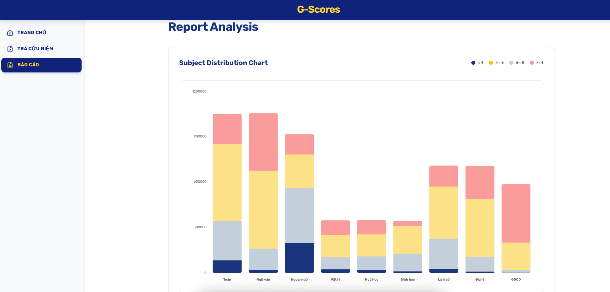
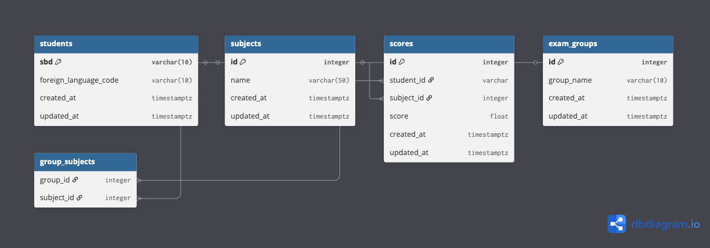
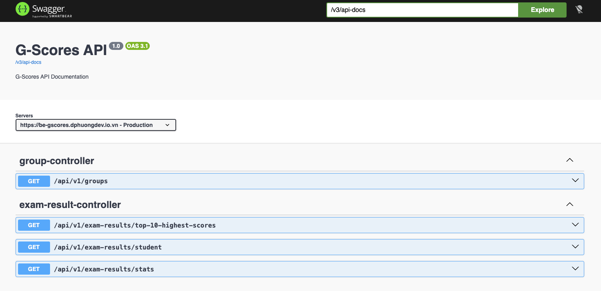

# G-Scores

Ứng dụng **tra cứu điểm thi THPT** (theo SBD), **xếp hạng Top 10 theo khối** và **thống kê theo môn**.

## Table contents

- [Link Demo](#link-demo)
- [Tech Stack](#tech-stack)
- [UI](#ui)
- [Database](#database)
- [API](#api)
- [Usage](#usage)
- [Contributor](#contributor)
- [Contact](#contact)

---

## Tech Stack

- **Frontend:** Next.js, Tailwind CSS
- **Backend:** Spring Boot 3.5, Java 21, Spring Data JPA, Redis (cache), Flyway
- **Database:** PostgreSQL 16
- **Infra:** Docker Compose, Cloudflare Tunnel

## Link Demo

[https://gscores.dphuongdev.io.vn](https://gscores.dphuongdev.io.vn)

## UI

### Trang chủ / Top 10 theo khối



### Tra cứu điểm theo SBD



### Báo cáo thống kê



## Database



## API



## Usage

### Step 1: Clone the Repository

```bash
git clone https://github.com/DuyPhuongDev/g-scores-GOS.git
cd g-scores-GOS
```

### Step 2: Checkout dev branch and pull code

```bash
git checkout dev
git pull origin dev
```

### Step 3: Run containers

```bash
docker compose up -d
# wait about 5 minutes to seed data
```

### Step 5: Check status seed data

```bash
    docker logs --tail 10 gscores-backend # If see log "Done importing data..." => done seed data
```

### Step 6: Open service

```bash
    http://localhost:3000 (Front-End)
    http://localhost:8888/swagger-ui/index.html (Back-End API docs)
```

### Step 7: Stop service

```bash
docker compose down
```

## Contributor

- Duy Phuong

## Contact

- Email: duyphuong.devg@gmail.com
